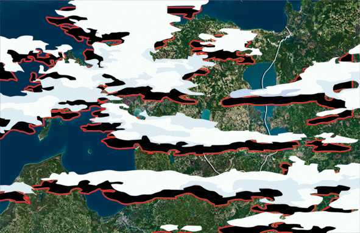

# Projeto 9 - Detector de Nuvens e Sombra de Nuvens

### Instituto Nacional de Pesquisa Espacial (INPE)
### Disciplina: SER-347 - Introdução à Programação para Sensoriamento Remoto - 2020

_______________________________
_______________________________

## Objetivo:
Desenvolver um detector de nuvens e sombra de nuvens, baseado na informação espectral e em metadados (posição do sol, posição do satélite) para criar máscaras de processamento.

## Integrantes:
- Aline Casassola
- Felipe Rafael de Sá Menezes Lucena
- Grazieli Rodigheri

## Considerações do trabalho:
- Como resultado, apresentar um código organizado com funções e documentação.
- Os produtos de código desenvolvidos deverão ser licenciados de acordo com os modelos de software livre MIT ou Apache, e disponibilizados em um repositório na organização SER-347.
- Os produtos de dados (amostras) deverão ser disponibilizados de acordo com o modelo Creative Commons.
- Produzir um relatório no formato do SBSR.

_______________________________
_______________________________

## 1 - Pacotes utilizados
   Os pacotes utilizados para a execução estão listados abaixo. As versões de alguns pacotes que estão especificadas abaixo garantiram o funcionamento sem erros de execução.

      gdal = 3.0.4
      shapely = 1.7.0
      fiona = 1.8.11
      os
      xml
      matplotlib
      numpy
      ipywidgets
      math

## 2 - Execução do algoritmo
   Para a execução do algoritmo, é necessário abrir o terminal de comando na pasta raíz desse repositório e executar o seguinte comando:
      
      jupyter notebook

   A seguir, acesse a pasta **notebooks** e acesse o notebook principal do projeto, chamado:

      cloud_and_shadow_mask.ipynb

## 3 - Descrição geral do Sistema:
   ### 3.1 Entradas
   O algoritmo foi desenvolvido para ter como entradas as imagens da plataforma CBERS 4. O repositório contém um diretório chamado **imagens** que contém todas as cenas disponíveis para o processamento. Essas cenas estão organizadas em diretórios, onde cada pasta significa uma cena disponível. Dentro de cada uma dessas pastas, há pastas contendo as bandas disponíveis dessa imagem. Cada uma dessas pastas de bandas possui o arquivo **.tif** e o **.xml** que deve, **obrigatoriamente**, possuir o mesmo nome que o diretório da banda. Abaixo, há um exemplo de uma imagem já disponível no repositório:
   - imagens/
      - CBERS_4_MUX_20200606_156_109_L2/ **(Esse nome é o que vai aparecer no dropdown. Pode ser qualquer nome)**
         - 200606_BAND6/ **(O nome dessa pasta deve ter como último caractere o número da banda)**
            - 200606_BAND6.tif **(Esse nome deve ser igual ao da pasta)**
            - 200606_BAND6.xml **(Esse nome deve ser igual ao da pasta)**
         - ...
      - ...
   - ...
      
   Na execução do notebook principal,  **notebooks/cloud_and_shadow_mask.ipynb**, há 3 entradas principais:
   - **Dropdown para a seleção de cenas:** O usuário seleciona a cena desejada. Quando a célula é executada, o programa percorre a pasta **imagens** e apresenta apenas as pastas que estão contidas nela.
   - **Toggle Buttons para a seleção de banda:** O usuário seleciona a banda desejada. Quando a célula é executada, o programa percorre a pasta da cena desejada e apresenta as bandas disponíveis.
   - **Slider para a seleção de limiar:** O usuário seleciona o limiar desejado para a criação da máscara de nuvens. Pixels com valores acima disso representam nuvens, representados como 1 na máscara, e pixels abaixo do limiar possuem o valor 0.

   ### 3.2 Processamento
   O processamento dos dados é basicamente separado em 2 módulos principais:
   - **Geração da máscara de nuvens:** A imagem selecionada é aberta e a máscara de nuvens é criada com base no limiar. Há uma apresentação da imagem selecionada e da máscara de nuvem para que o usuário verifique se o limiar selecionado é suficiente para a detecção de nuvens. Após o processamento, é gerado um arquivo **.tif** de saída e o mesmo é salvo no diretório **produtos**.
   - **Geração da máscara de sombra:** A máscara de nuvens é aberta e vetorizada para um arquivo **.shp**. Os cálculos do ângulo da sombra e o deslocamento são feitos, levando em consideração o ângulo de incidência solar e o ângulo de visada. Após alguns tratamentos, os polígonos de nuvem são deslocados e é realizada a subtração de desse resultado pela máscara de nuvens, resultando em apenas os polígonos com possíveis sombra, como é apresentado no GIF a seguir. Todos os arquivos temporários, bem como os produtos, são salvos na pasta **produtos**. Após o processamento, a máscara de sombra é salva no formato vetorial **(.shp)** e também rasterizada para um raster **(.tif)**.

   

      
   ### 3.3 Resultados
   Abaixo é apresentada uma utilização das máscaras geradas. Em um software SIG, foram plotadas a imagem e as máscaras:

   

   
## 4. Trabalhos Futuros:
   - Para o cálculo do deslocamento de pixels da máscara de sombra, é possível alterar a constante de altura de nuvem com base em uma nova literatura.
   - ...